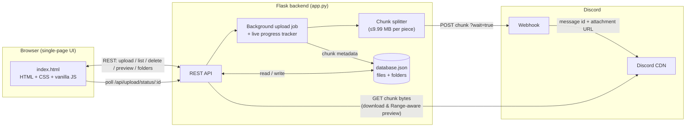
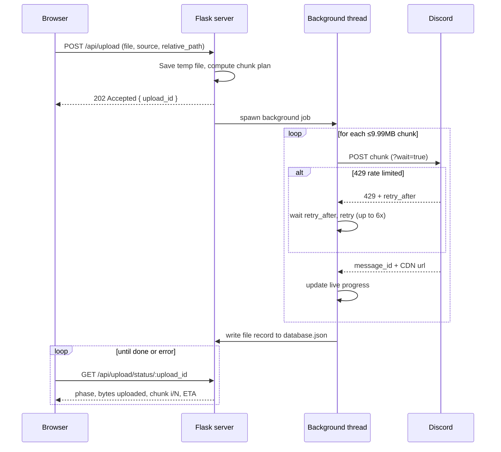

# ☁️ Nimbus

**A self-hosted cloud storage app that uses a Discord webhook as its storage backend.**

Nimbus gives you a Google Photos/Dropbox-style interface — galleries, nested folders, live previews, multi-select — backed by nothing more exotic than a Flask server and a Discord webhook. Files larger than Discord's attachment cap are split into chunks, uploaded individually, and reassembled byte-for-byte on demand.

[](LICENSE)
[](https://www.python.org/)
[](https://flask.palletsprojects.com/)
[](#tech-stack)
[](#contributing)
[](https://github.com/EncryptWiser/Nimbus/stargazers)


## Why Nimbus

Discord webhooks are a well-known trick for free file hosting, but most implementations of the idea stop at "upload a file, get a link." Nimbus takes that further and treats it like an actual storage product:

- **No arbitrary size limit.** Files bigger than Discord's per-message cap are transparently split into chunks and reassembled — the size limit disappears from the user's perspective.
- **A real metadata layer.** A local `database.json` tracks every file's chunks, folder placement, capture date, and upload source — so downloads, previews, search, and folder browsing all work the way they would in a real file manager, not just a flat list of Discord links.
- **Honest, live feedback.** Upload progress reflects what's *actually* happening server-side (including Discord rate-limit backoff), not just the browser-to-server transfer.
- **Single-file, dependency-light frontend.** The entire UI is one `index.html` — no build step, no bundler, no `node_modules`. Easy to read, easy to audit, easy to fork.
- **Transparent about tradeoffs.** See [Known limitations](#known-limitations) and [Security & Discord ToS considerations](#security--discord-tos-considerations) below — nothing here is oversold.

## Features

- 📦 **Unlimited effective file size** — files over Discord's 10 MB webhook cap are automatically split into ≤9.99 MB chunks, each uploaded as its own message/attachment, and reassembled byte-for-byte on download or preview.
- 📊 **Live upload progress** — a real, two-phase progress bar (browser → server, then server → Discord) with live transferred bytes and an ETA, backed by a polling background job — not a fake spinner.
- 🔁 **Automatic rate-limit recovery** — Discord `429` responses are retried automatically with the exact backoff Discord asks for, with a manual "Try again" button as a fallback if retries are exhausted.
- 🖼️ **Gallery** — photos/videos uploaded *from the Gallery tab* specifically, grouped by date (EXIF capture date when available, otherwise upload time).
- 🔍 **Live preview / lightbox** — click any photo or video to view it full-size before downloading, including large, multi-chunk videos, via a Range-request-aware preview endpoint that reassembles on the fly (so seeking/scrubbing works).
- 📁 **Real nested folders** — subfolders live under their actual parent (never flattened), can be created empty, deleted (recursively, with confirmation), and uploaded into directly.
- 🗂️ **All Files** — every file uploaded through Nimbus, from any tab, sorted newest-first, with a live count.
- ✅ **Multi-select** — including **Select all** — to bulk-download (as a zip) or bulk-delete.
- 🗑️ **Live delete status** — a status indicator confirms exactly when files (single, bulk, or a whole folder) are being deleted and when it's done.
- 📈 **Live storage widget** — total bytes, total chunk count, and a segmented Images/Videos/Docs/Audio breakdown, updated in real time.
- 🎨 **Dark, purpose-built UI** — no UI framework, no CSS framework — a hand-built dark theme with a slide-out upload manager and floating action button.

## Architecture

### System overview



Nimbus has three moving pieces:

1. **Frontend** — a single `templates/index.html` containing all markup, styling, and logic. It talks to the backend exclusively over a small REST API and never touches Discord directly.
2. **Backend** — a Flask app that owns all Discord interaction, chunk splitting/reassembly, EXIF extraction, and the flat-file metadata store.
3. **Discord** — used purely as a storage/CDN layer via a single webhook. Nimbus never uses a bot token or the full Discord API; a webhook URL is the only credential involved.

### Upload flow (chunking + live progress)

A naive implementation would show "100%" the moment the browser finishes sending the file to the server — then go quiet while the server does the slow part (pushing chunks to Discord). Nimbus avoids that by running uploads as a background job the frontend polls:



This is what powers the two-phase progress bar (0–50% browser→server, 50–100% server→Discord), the live "part i/N" and ETA text, and the automatic recovery from Discord rate limits without failing the whole upload.

### Data model

All metadata lives in a single `database.json`, shaped like:

```json
{
  "files": [
    {
      "id": "b3f1...",
      "filename": "beach.jpg",
      "relative_path": "Vacation/Hawaii/beach.jpg",
      "folder_path": "Vacation/Hawaii",
      "size_bytes": 21474836,
      "is_chunked": true,
      "chunk_count": 3,
      "chunks": [
        { "index": 1, "message_id": "...", "cdn_url": "https://cdn.discordapp.com/...", "size_bytes": 9990000 }
      ],
      "captured_date": "2024-06-21 14:30:02",
      "uploaded_at": "2024-06-21T20:11:05Z",
      "source": "gallery"
    }
  ],
  "folders": ["Vacation", "Vacation/Hawaii"]
}
```

A file's `chunks` array is the source of truth for reassembly — download and preview both walk it in `index` order and stitch the bytes back together, whether that's a full download, a zipped bulk download, or a Range-aware streamed preview.

### Folder model

Folders are stored as **explicit entities**, not just inferred from file paths. Uploading into `Vacation/Hawaii/Beach` auto-registers `Vacation`, `Vacation/Hawaii`, and `Vacation/Hawaii/Beach` as real folders — so the tree survives even if every file inside is later deleted. Deleting a folder recursively removes it, every nested subfolder, and every file inside (along with their Discord messages).

## Tech stack

| Layer | Choice | Why |
|---|---|---|
| Backend | **Flask** (Python) | Minimal, well understood, easy to self-host |
| Frontend | **Vanilla HTML/CSS/JS** | No build step, no framework lock-in, trivial to audit |
| Storage | **Discord webhook + CDN** | Free, no infrastructure to manage |
| Metadata | **Flat-file JSON** (`database.json`) | Zero setup, human-readable, fine at personal/small-team scale |
| Image metadata | **Pillow** (optional) | EXIF `DateTimeOriginal` extraction for date-based sorting |
| HTTP | **requests** | Talking to Discord's webhook API |

## Runs natively — nothing extra to install

Nimbus is intentionally low-tech. There's no build step, no bundler, no
container runtime, and no separate database server to stand up. If you have
Python and pip, you have everything Nimbus needs:

- **No Docker required.** Just `python app.py`.
- **No Node.js, npm, or bundler.** The entire frontend is one plain
  `index.html` file — open a browser tab and it works. No `webpack`,
  `vite`, `npm install`, or `node_modules` anywhere in this project.
- **No database server.** Metadata lives in a single local `database.json`
  file — no PostgreSQL, MySQL, MongoDB, or Redis to install or configure.
- **No cloud account beyond Discord itself.** No AWS/GCP/Azure signup, no
  paid tier, no API keys other than the one Discord webhook URL you create
  for free.
- **Runs on your own machine (or any box you control)** — Windows, macOS,
  or Linux, anywhere Python 3.9+ runs.

In short: `git clone`, `pip install flask requests pillow`, `python app.py`.
That's the entire setup.

## Getting started

### Prerequisites

- Python 3.9+
- A Discord account and a server you control (free to create)

### 1. Clone and install

```bash
git clone https://github.com/EncryptWiser/Nimbus.git
cd Nimbus
pip install flask requests pillow
```

> Pillow (used for EXIF-based "Captured Date" sorting) is optional — Nimbus
> runs fine without it, just falling back to upload time for date sorting.

### 2. Create a Discord webhook

1. In a Discord server you control, create a channel dedicated to storage (recommended — it will fill up with file messages).
2. Channel settings → **Integrations** → **Webhooks** → **New Webhook**.
3. Name it, then **Copy Webhook URL**.

> [!WARNING]
> **Keep this server private — don't add or invite anyone to it.** Nimbus's
> folders, permissions, and "who can see what" only exist inside the app.
> Discord itself doesn't know about any of that — so anyone who's a member
> of the server (or has an invite link to it) can open the storage channel
> and see, open, and download **every file you've ever uploaded**, in full,
> with no restrictions. Use a server only you belong to, don't share invite
> links to it, and treat the webhook URL itself as a secret too.

It looks like:
```
https://discord.com/api/webhooks/1234567890123456789/AbCdEfGhIjKlMnOpQrStUvWxYz...
```

### 3. Configure the webhook URL

**Environment variable (recommended):**
```bash
export DISCORD_WEBHOOK_URL="https://discord.com/api/webhooks/<id>/<token>"
```

**Or hardcode it** in `app.py` (don't commit this to a public fork):
```python
DISCORD_WEBHOOK_URL = os.environ.get(
    "DISCORD_WEBHOOK_URL",
    "https://discord.com/api/webhooks/REPLACE_WITH_ID/REPLACE_WITH_TOKEN",
)
```

### 4. Run it

```bash
python app.py
```

Open **http://localhost:5000**. No build step, no `npm install` — the whole frontend is one Flask-served HTML file.

## Using Nimbus

- **Upload** — the floating **+** button uploads to wherever makes sense for your current tab (Gallery, All Files, or wherever you are in Folders). Inside a folder, **+** is replaced by **Upload here**; at the folder root, **Upload folder** brings in a whole local directory tree via `webkitdirectory`.
- **Browse** — **Gallery** shows only Gallery-tab uploads grouped by date; **Folders** is a real nested browser with breadcrumbs and a **New folder** button; **All Files** lists everything.
- **Preview** — click any photo/video for a full-size lightbox with arrow-key navigation, even for large multi-chunk videos.
- **Select, download, delete** — click **Select** (or **Select all**) to check off files, then bulk-download as a zip or bulk-delete, with a live status indicator either way.
- **Delete a folder** — hover a folder tile and click the trash icon to remove it and everything inside, after confirming.

## API reference

All routes are relative to `http://localhost:5000`.

| Method | Route | Purpose |
|---|---|---|
| `GET` | `/` | Serves the app UI |
| `GET` | `/api/files` | List every file record |
| `POST` | `/api/upload` | Start an upload — returns `{upload_id, chunk_total, total_bytes}` (`202`) |
| `GET` | `/api/upload/status/<upload_id>` | Poll live progress for an in-flight upload |
| `DELETE` | `/api/files/<file_id>` | Delete one file (and its Discord messages) |
| `POST` | `/api/files/bulk-delete` | Body: `{"ids": [...]}` — delete several files at once |
| `GET` | `/api/files/<file_id>/download` | Reassembles chunks and downloads the original file |
| `POST` | `/api/files/bulk-download` | Body: `{"ids": [...]}` — zips several reassembled files into one download |
| `GET` | `/api/files/<file_id>/preview` | Inline, Range-aware stream for the lightbox (supports `206 Partial Content`) |
| `GET` | `/api/folders` | List every known folder path |
| `POST` | `/api/folders` | Body: `{"path": "Parent/NewFolder"}` — create a (possibly empty) folder |
| `POST` | `/api/folders/delete` | Body: `{"path": "..."}` — recursively delete a folder, its subfolders, and its files |

`POST /api/upload` accepts `multipart/form-data` with `file`, `relative_path` (folder placement), and `source` (`"gallery"` / `"folders"` / `"all"`).

## Project structure

```
Nimbus/
├── app.py                 # Flask backend — all API routes + Discord/EXIF/chunk logic
├── requirements.txt       # Python dependencies (pip install -r requirements.txt)
├── templates/
│   └── index.html         # Entire frontend — markup, styles, and JS in one file
├── temp_storage/          # Scratch space during upload processing (auto-cleaned; kept via .gitkeep, not committed contents)
├── database.json          # Auto-created on first run — NOT committed (see .gitignore)
├── .gitignore
├── LICENSE
└── README.md
```

## Configuration

| Setting | Where | Default | Notes |
|---|---|---|---|
| `DISCORD_WEBHOOK_URL` | env var or top of `app.py` | placeholder | **Required** |
| `CHUNK_SIZE` | top of `app.py` | `9.99 MB` (`int(9.99 * 1_000_000)`) | Bytes per chunk, kept just under Discord's 10 MB cap |
| `DISCORD_MAX_RETRIES` | top of `app.py` | `6` | Automatic retry attempts on Discord `429`/`5xx` before giving up |
| Port | bottom of `app.py` | `5000` | Change if already in use |

## Testing

Nimbus's core logic — chunk splitting and byte-perfect reassembly, Discord rate-limit retry/backoff, recursive folder deletion, bulk download/delete, and EXIF-based date sorting — has been exercised with scripted tests against a mocked Discord API during development (see the commit history / PR descriptions for specifics). A formal `pytest` suite under `tests/` is on the [roadmap](#roadmap) — contributions here are very welcome.

## Known limitations

- **No authentication.** Anyone who can reach the server can upload, browse, download, and delete files. Fine for local/personal use; add your own auth layer (e.g. a reverse proxy with basic auth) before exposing this beyond `localhost`.
- **Single-user, flat-file database.** `database.json` isn't built for concurrent, multi-writer workloads — fine for personal/small-team use, not a multi-tenant SaaS backend.
- **Bulk download buffers in memory.** Zipping many very large files at once can use significant RAM.
- **Preview Range requests fetch whole chunks.** Scrubbing a large, split video pulls the full ≤9.99 MB chunk containing the requested byte range, not a byte-precise sub-fetch — correct, just not maximally bandwidth-efficient.
- **Depends on Discord's webhook/CDN behavior**, which isn't an officially supported "storage product" and could change.

## Security, privacy & Discord ToS considerations

### Your data stays yours

Nimbus has no backend operated by its maintainers, no telemetry, and no
analytics — because there's nothing here *to* collect from. Concretely:

- **There is no "Nimbus server."** This is source code you run yourself.
  When you `python app.py`, the only server that exists is the one on your
  own machine — nobody else's infrastructure is involved.
- **No accounts, no sign-up, no phone-home.** Nimbus doesn't ask you to log
  in to anything except your own Discord webhook, and it makes no network
  calls except to Discord's API/CDN (to store/fetch your files) and to
  your own browser (to serve the UI). There's no analytics SDK, crash
  reporter, or update-checker quietly calling home in the background —
  check `app.py` yourself; every `requests.*` call in it targets Discord.
- **All metadata stays local.** Filenames, folder structure, upload dates —
  everything Nimbus knows about your files lives in your own local
  `database.json`, on your own disk. The maintainers of this project never
  see it, store it, or have any way to access it.
- **The maintainers have no access to your files.** Your files live in a
  Discord channel you control, addressed by a webhook URL only you hold.
  Nobody involved in building Nimbus can see, download, or is otherwise
  aware of what you store with it.

In short: this is self-hosted software, not a hosted service — "your data"
never leaves your own machine and your own Discord server.

### Known security tradeoffs

Be transparent with yourself and anyone you share this with:

- **No authentication.** Anyone who can reach the server can upload, browse, download, and delete files. Fine for local/personal use; add your own auth layer (e.g. a reverse proxy with basic auth) before exposing this beyond `localhost`.
- **Treat your webhook URL as a secret.** Anyone with it can post to (and, via Discord's API directly, delete from) your channel.
- **Using Discord as a storage backend is a community-known pattern, not an officially sanctioned Discord feature.** Automated, high-volume use of webhooks in ways not intended for normal chat use may be subject to Discord's Terms of Service and could be rate-limited or restricted at Discord's discretion. Use a server/channel you control, keep volume reasonable, and don't rely on this for anything business-critical.
- **No end-to-end encryption.** Files are visible to anyone with access to the Discord channel/server independent of this app.
- **Don't expose Nimbus directly to the public internet** without adding authentication — it has none built in.

## Roadmap

- [ ] Formal `pytest` test suite + CI workflow
- [ ] Optional authentication layer
- [ ] Pluggable storage backends (so Discord is one option, not the only one)
- [ ] Dockerfile / docker-compose for one-command deployment
- [ ] Configurable database backend (SQLite option for larger libraries)

## Contributing

Contributions are welcome — this is a young project and there's plenty of room to help:

1. Fork the repo and create a branch: `git checkout -b feature/my-change`
2. Make your change (keep the frontend a single `index.html` file and the backend a single `app.py` unless there's a strong reason to split them)
3. Test it locally against your own webhook
4. Open a pull request describing what changed and why

Bug reports and feature requests are just as valuable as code — please open an issue.

## License

Nimbus is released under the [MIT License](LICENSE) — use it, fork it, modify it, ship it.

---

*Nimbus is an independent, community-built project and is not affiliated with, endorsed by, or sponsored by Discord Inc.*
